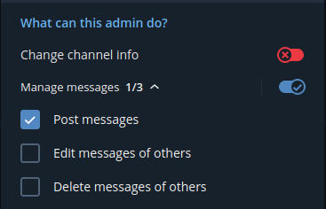
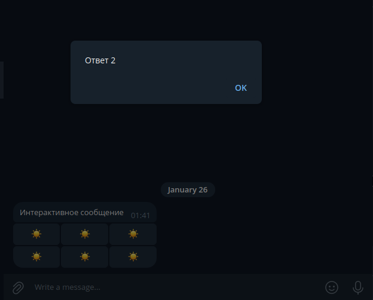

Бот может создавать интерактив на кнопки


Чтобы это работало:
- если необходимо отправлять пост в канал, добавить бота админом в канал. У бота должны быть права админа на постинг сообщений:

- отправить в нужный чат сообщение с кнопками. Пример
```json
{
  "text": "Интерактивное сообщение",
  "parse_mode": "MarkdownV2",
  "reply_markup": {
    "inline_keyboard": [
      [
        {
          "text": "☀️",
          "callback_data": "Ответ 1"
        },
        {
          "text": "☀️",
          "callback_data": "Ответ 2"
        },
        {
          "text": "☀️",
          "callback_data": "Ответ 3"
        }
      ],
      [
        {
          "text": "☀️",
          "callback_data": "Ответ 4"
        },
        {
          "text": "☀️",
          "callback_data": "Ответ 5"
        },
        {
          "text": "☀️",
          "callback_data": "Ответ 6"
        }
      ]
    ]
  }
}
```

Результат - по нажатию кнопки бот выводит системное уведомление с текстом из `callback_data` нажатой кнопки:
